# 03 - Arquitectura y Flujo del Worker

Este documento detalla el diseño de software de la aplicación móvil "Topo Túnel" y cómo implementa los requerimientos de sincronización, concurrencia y persistencia en segundo plano.

---

## 1. Diseño del Flujo: Claim-Lock Pattern

El sistema opera bajo un flujo diseñado para evitar que múltiples dispositivos móviles procesen la misma tarea de raspado (scraping) simultáneamente, optimizando el ancho de banda y la velocidad de respuesta.

```mermaid
sequenceDiagram
    participant Backend
    participant Worker 1 (Móvil)
    participant Worker 2 (Móvil)
    participant MercadoLibre

    Backend->>Worker 1: Evento WebSocket (NewScrapingTask: task_id: 101)
    Backend->>Worker 2: Evento WebSocket (NewScrapingTask: task_id: 101)
    
    rect rgb(30, 41, 59)
        Note over Worker 1, Worker 2: Intento de reclamación (Claim)
        Worker 1->>Backend: POST /claim (worker_id: A, task_id: 101)
        Worker 2->>Backend: POST /claim (worker_id: B, task_id: 101)
    end
    
    Backend-->>Worker 1: success: true (Bloqueo Adquirido)
    Backend-->>Worker 2: success: false (Bloqueo Rechazado)
    
    rect rgb(15, 23, 42)
        Note over Worker 2: Ignora la tarea silenciosamente y vuelve al estado de escucha
    end
    
    Worker 1->>MercadoLibre: HTTP GET (User-Agent Móvil)
    MercadoLibre-->>Worker 1: HTML Crudo
    
    Worker 1->>Backend: POST /callback (task_id: 101, html: "<html>...")
    Backend-->>Worker 1: Confirmación de guardado
```

---

## 2. Segundo Plano Resiliente (Foreground Service)

En dispositivos modernos (tanto Android como iOS), el sistema operativo suspende las conexiones de sockets o peticiones HTTP de fondo para ahorrar batería en menos de 5 minutos si la app se minimiza.

### Solución con Foreground Service (Servicio de Primer Plano):
1. Al pulsar **"Activar Túnel"**, la aplicación inicia un servicio nativo de primer plano a través de `@notifee/react-native`.
2. Esto obliga al sistema operativo a tratar la aplicación como un proceso prioritario (como un reproductor de música o GPS).
3. Se muestra una notificación sutil y persistente en la barra de estado: `"Topo Túnel - Activo y esperando tareas..."`.
4. El WebSocket mantiene su ciclo de vida y reconexión activa indefinidamente mientras el túnel esté activado.
5. Al pulsar **"Desactivar Túnel"**, el servicio en primer plano es detenido y el WebSocket es cerrado limpiamente para no consumir datos ni batería en reposo.

---

## 3. Optimización de Peticiones y Seguridad del Cliente

Para evitar que MercadoLibre identifique y bloquee el tráfico de scraping, se aplican las siguientes optimizaciones nativas:

* **User-Agent Realista:** Se inyecta un encabezado `User-Agent` móvil estándar que simula un navegador Chrome ejecutándose en Android 13:
  `Mozilla/5.0 (Linux; Android 13; SM-S918B) AppleWebKit/537.36 (KHTML, like Gecko) Chrome/112.0.0.0 Mobile Safari/537.36`
* **Encabezados Adicionales:** Se envían cabeceras de lenguaje y aceptación habituales de dispositivos en Latinoamérica para mimetizar tráfico humano.
* **Procesamiento Cero:** El móvil actúa estrictamente como un proxy. **No se realiza ningún parseo ni manipulación del HTML**. El string crudo se retransmite directamente al backend para reducir el uso de CPU y evitar fugas de memoria.
* **Tiempo de Espera (Timeout):** Las llamadas a MercadoLibre tienen un límite de espera estricto de 15 segundos. Si la conexión móvil es inestable y expira, se libera el estado de procesamiento sin colgar el hilo principal.
